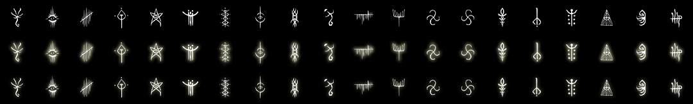

Some homemade assets for some applications.

## Table

|app|collect|files|preview|description|
|---|---|---|---|---|
|[Cmder](https://cmder.app)|[low line](low-line)||||
|[Open-Shell](https://github.com/Open-Shell/Open-Shell-Menu)|[Bloodborne Caryll Runes](bloodborne-caryll-runes)|||[link](https://github.com/scillidan/repo_asset/tree/main/bloodborne-caryll-runes)|